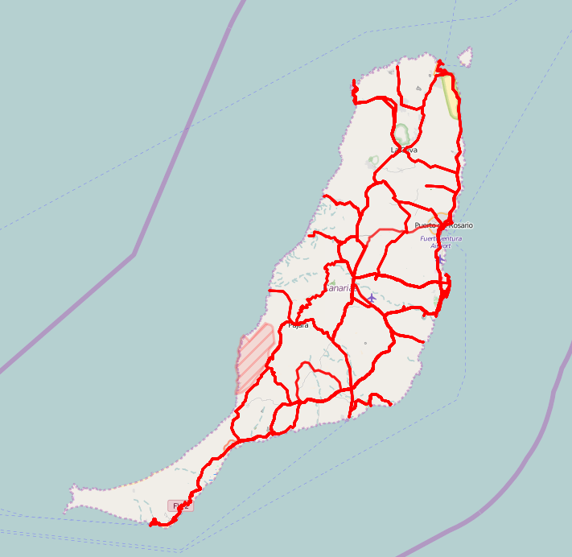

# strava-activity-map

Simple node.js application to display your Strava activity during some period on a map. In order to use it, you need to provide an access token for your Strava activity. This token is currently available at https://www.strava.com/settings/api/ under "Your access token".

One can change the tile server and thus the look of the map by editing the `tiles` variable in `frontend.js`.

Currently, the fetched date range is hard coded in `app.js`.

## Installation

* Set your Strava access token in the environment variable `$STRAVA_ACCESS_TOKEN`
* Install required packages with `npm install`
* Run the server with `npm start`
* The map should be available at `http://localhost:3000/`
